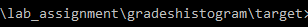
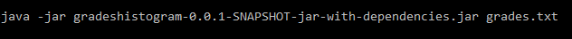
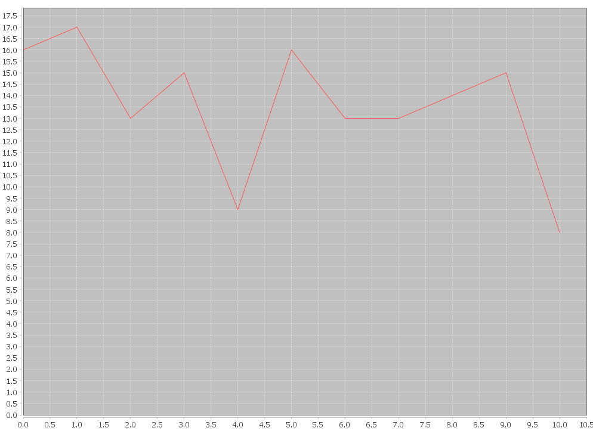

# Second lab assignment

## Overview

In this project you can pass a file with grades and the program will create a histogram with the grades you passed.

## Requirements

This project requires:

* Java JDK version 1.7 (or later)

## Tools and Technologies used for the project

The tool that have been used is Maven and the code that builds the diagram you can find it [here](https://github.com/AntonisGkortzis/BuildAutomationToolsDemoProject/blob/master/histogramgenerator/src/main/java/histogramgenerator/JFreeChartXYLineChartDemo.java).

## Usage

### First you need to clone or download the repository.
### Secondly you have to transfer you txt file with your grades in this folder:

### In order to run the program you will have to write this in the command line

### And the result will be this

## Contributing
Contribution is always welcome. For major changes, please open an issue first to discuss what you would like to change.

## License
[MIT](https://choosealicense.com/licenses/mit/)